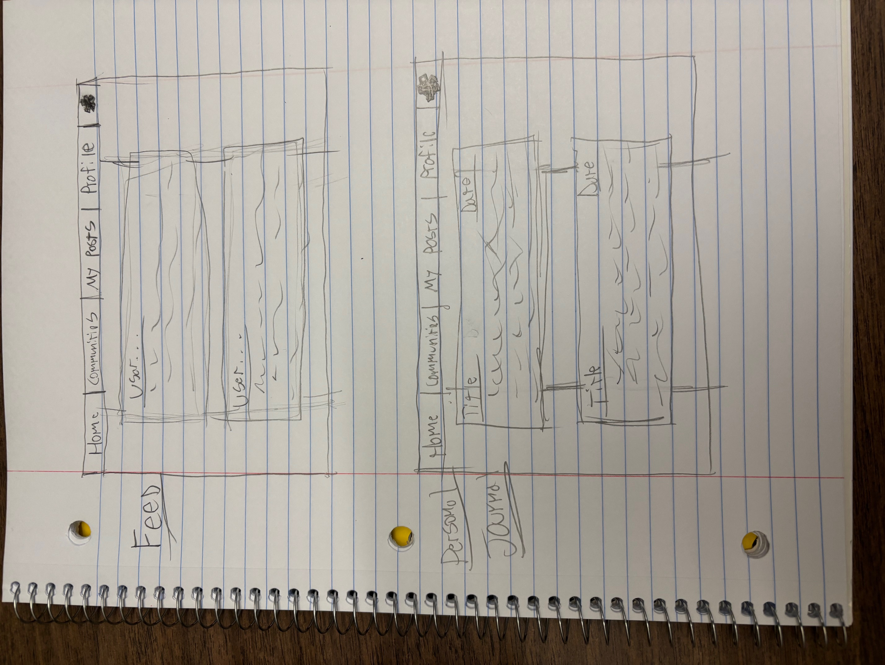
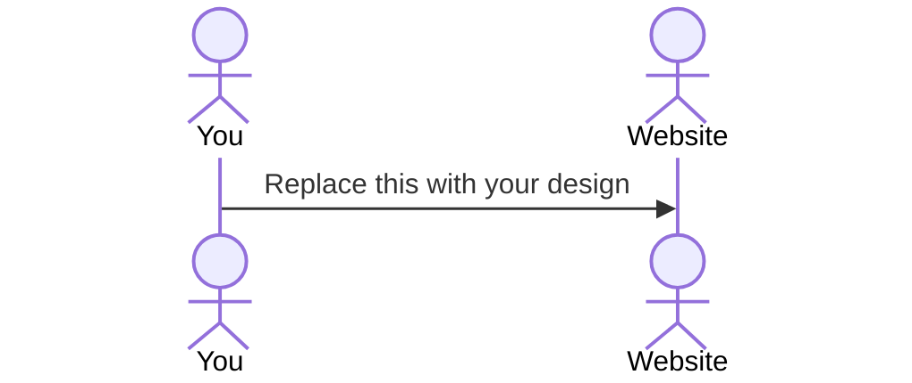

# Dreamscape

[Notes](notes.md)

This website is going to be about dreams. My family likes to share our dreams with each other, and it's really interesting to hear about them. This website is going to be a place where you can record your dreams to create a personal dream journal. Also where you can read about other people's dreams and share your own with them. This website will also have different communites where you can read about certain types of dreams, or dreams on certain topics and will allow you to find dreams that your friends have posted. 

> [!NOTE]
>  With the html deliverable I added, well, the html. It's got a navbar so you can access the four different pages. There's also a fifth page that's only for when you want to create an account, and that's accessed through a button on the log in page. The rest is pretty straightforward, images and words that will eventually be turned into chats and whatnot. Because this is going to be a social media type website, I think that the javascript and websocket stuff is really going to make a difference. 

> [!NOTE]
>  If you are not familiar with Markdown then you should review the [documentation](https://docs.github.com/en/get-started/writing-on-github/getting-started-with-writing-and-formatting-on-github/basic-writing-and-formatting-syntax) before continuing.

## 🚀 Specification Deliverable

> [!NOTE]
>  Fill in this sections as the submission artifact for this deliverable. You can refer to this [example](https://github.com/webprogramming260/startup-example/blob/main/README.md) for inspiration.

For this deliverable I did the following. I checked the box `[x]` and added a description for things I completed.

- [ ] Proper use of Markdown
- [ ] A concise and compelling elevator pitch
- [ ] Description of key features
- [ ] Description of how you will use each technology
- [ ] One or more rough sketches of your application. Images must be embedded in this file using Markdown image references.

### Elevator pitch

Have you ever been curious about the dreams other people have? How they're different or simliar to your own? Dreamscape offers an environment where you can read and share your dreams online with other people. Create communities with people who have simliar dreams to you, or create conversations about certain types of dreams. 

### Design

This image shows a basic layout of how the website will work. It'll have a few different pages, though many of them will appear similar. Your homepage will give you a basic feed that shows popular dreams and dreams from your friends. Then, in the communities tab you can check out specific chats, topics, and so forth. Then, on the my posts tab, you can check the dreams you've posted for othe people to see which will look similar. Finally, under the profile tab you'll have the option to select your personal journal, which keeps a diary of your dreams without publishing them for everyone to see. 

### Key features

- Describe your key feature
- Describe your key feature
- Describe your key feature

### Technologies

I am going to use the required technologies in the following ways.

- **HTML** - The html will build the content that you can read such as the tabs, and allow you to go to the different pages.
- **CSS** - The CSS will organize the page so that it looks neat to look at and not very cluttered. This will allow you to look through different posts.
- **React** - Each user will need to login in order to gain full functionality of the website. This will also be important for certain features like reacting to posts with a like/upvote. 
- **Service** - This will retogging in will allow them to acces their dream journal, bring up their friends list, allow them to post and comment, and will save certain user settings like a profile picture and name.
- **DB/Login** - The database will be very important because this is where all the posts about people's dreams will be stored.
- **WebSocket** - This will get real time data that will help with the chatting and commenting on posts.

## 🚀 AWS deliverable

For this deliverable I did the following. I checked the box `[x]` and added a description for things I completed.

- [x] **Server deployed and accessible with custom domain name** - [My server link](https://nathantbenson.click/).

## 🚀 HTML deliverable

For this deliverable I did the following. I checked the box `[x]` and added a description for things I completed.

- [x] **HTML pages** - It's got four different pages, and technically a fifth page acced through the log in page meant only to create a new account.
- [x] **Proper HTML element usage** - I'm pretty sure I used all the tags correctly, it's got a header and a footer, with most of the stuff in the body.
- [x] **Links** - It's got links that take you to other pages in the website.
- [x] **Text** - It's got some basic text down, but most of the text is going to come as people make their own posts.
- [x] **3rd party API placeholder** - I wasn't sure what kind of 3rd party I could add that would help this out, so I was thinking you could log in through facebook or google.
- [x] **Images** - It's got a couple of images. One I was hoping to turn into a background for the website, and then you can scroll through posts that are on top of this background. I just thought it would be a cool asthetic. 
- [x] **Login placeholder** - It's got a log in page. 
- [x] **DB data placeholder** - It's got a placeholder of data on the log in page.
- [x] **WebSocket placeholder** - This is where I plan to put in some kind of feed. 

## 🚀 CSS deliverable

For this deliverable I did the following. I checked the box `[x]` and added a description for things I completed.

- [ ] **Header, footer, and main content body** - I did not complete this part of the deliverable.
- [ ] **Navigation elements** - I did not complete this part of the deliverable.
- [ ] **Responsive to window resizing** - I did not complete this part of the deliverable.
- [ ] **Application elements** - I did not complete this part of the deliverable.
- [ ] **Application text content** - I did not complete this part of the deliverable.
- [ ] **Application images** - I did not complete this part of the deliverable.

## 🚀 React part 1: Routing deliverable

For this deliverable I did the following. I checked the box `[x]` and added a description for things I completed.

- [ ] **Bundled using Vite** - I did not complete this part of the deliverable.
- [ ] **Components** - I did not complete this part of the deliverable.
- [ ] **Router** - I did not complete this part of the deliverable.

## 🚀 React part 2: Reactivity deliverable

For this deliverable I did the following. I checked the box `[x]` and added a description for things I completed.

- [ ] **All functionality implemented or mocked out** - I did not complete this part of the deliverable.
- [ ] **Hooks** - I did not complete this part of the deliverable.

## 🚀 Service deliverable

For this deliverable I did the following. I checked the box `[x]` and added a description for things I completed.

- [ ] **Node.js/Express HTTP service** - I did not complete this part of the deliverable.
- [ ] **Static middleware for frontend** - I did not complete this part of the deliverable.
- [ ] **Calls to third party endpoints** - I did not complete this part of the deliverable.
- [ ] **Backend service endpoints** - I did not complete this part of the deliverable.
- [ ] **Frontend calls service endpoints** - I did not complete this part of the deliverable.
- [ ] **Supports registration, login, logout, and restricted endpoint** - I did not complete this part of the deliverable.

## 🚀 DB deliverable

For this deliverable I did the following. I checked the box `[x]` and added a description for things I completed.

- [ ] **Stores data in MongoDB** - I did not complete this part of the deliverable.
- [ ] **Stores credentials in MongoDB** - I did not complete this part of the deliverable.

## 🚀 WebSocket deliverable

For this deliverable I did the following. I checked the box `[x]` and added a description for things I completed.

- [ ] **Backend listens for WebSocket connection** - I did not complete this part of the deliverable.
- [ ] **Frontend makes WebSocket connection** - I did not complete this part of the deliverable.
- [ ] **Data sent over WebSocket connection** - I did not complete this part of the deliverable.
- [ ] **WebSocket data displayed** - I did not complete this part of the deliverable.
- [ ] **Application is fully functional** - I did not complete this part of the deliverable.
